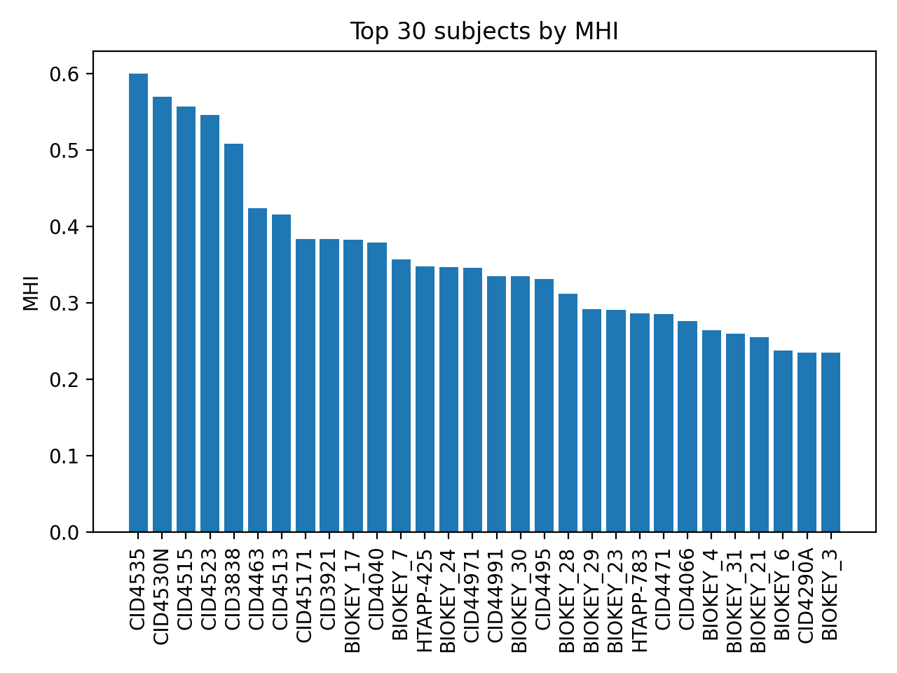
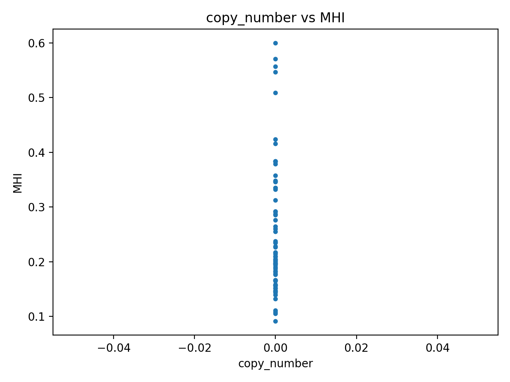
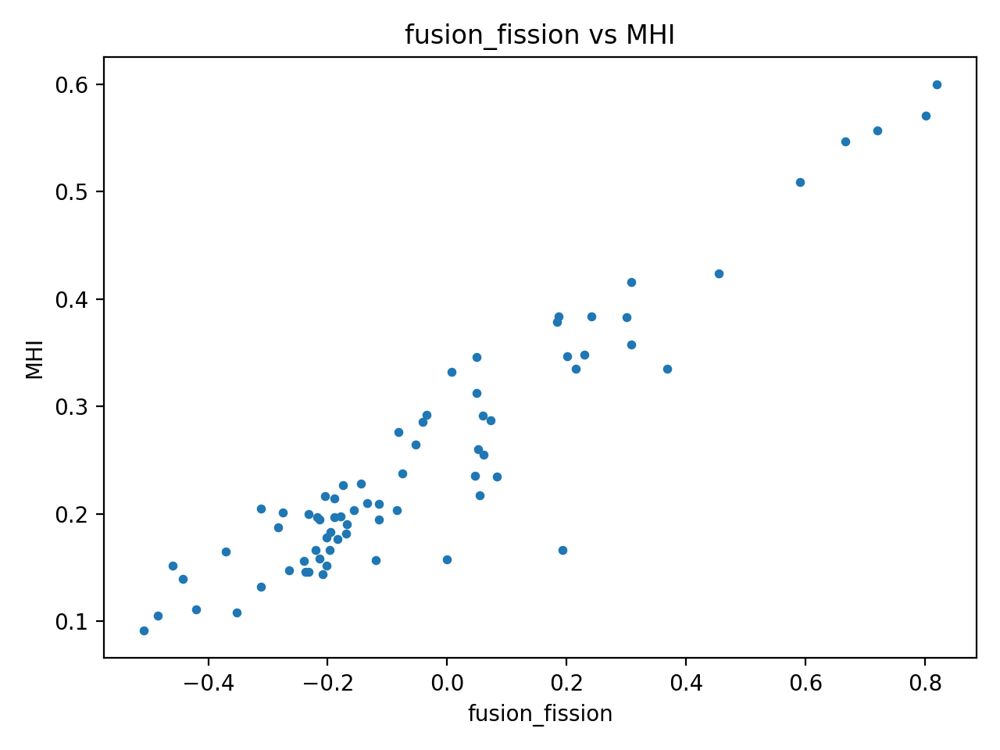
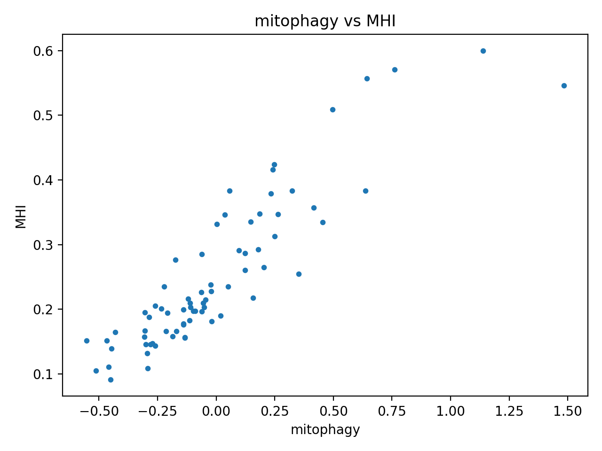
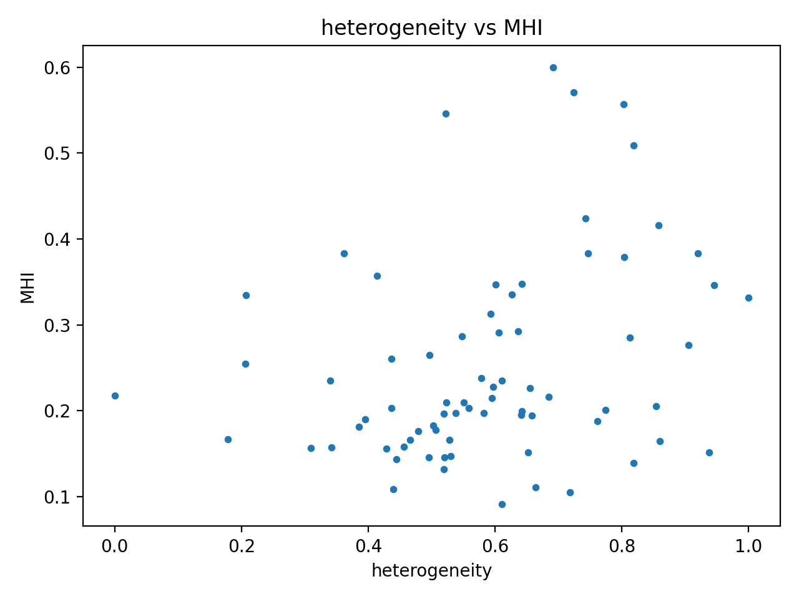

# MitoOmics-GPU Report

## Summary

- Subjects: **384**
- Metric: **MHI** (0–1 scaled combination of copy_number, fusion_fission, mitophagy, heterogeneity)

## Top Subjects (by MHI)

| subject_id   |      MHI |
|:-------------|---------:|
| CID4535      | 0.59998  |
| CID4530N     | 0.570431 |
| CID4515      | 0.556728 |
| CID4523      | 0.546311 |
| CID3838      | 0.508877 |
| CID4463      | 0.423661 |
| CID4513      | 0.41606  |
| CID45171     | 0.383603 |
| CID3921      | 0.38338  |
| BIOKEY_17    | 0.383118 |

## Figures

### mhi_top30

### scatter_copy_number

### scatter_fusion_fission

### scatter_mitophagy

### scatter_heterogeneity

